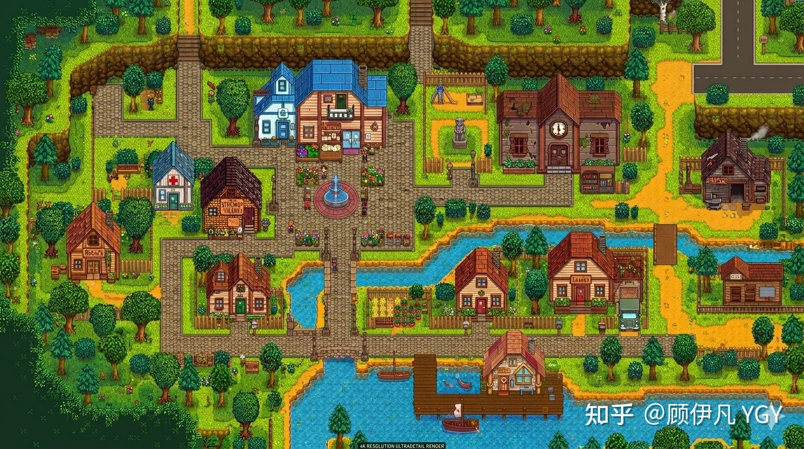
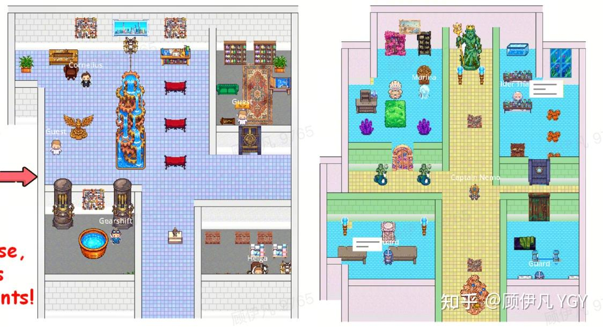
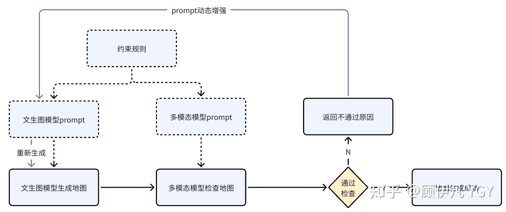
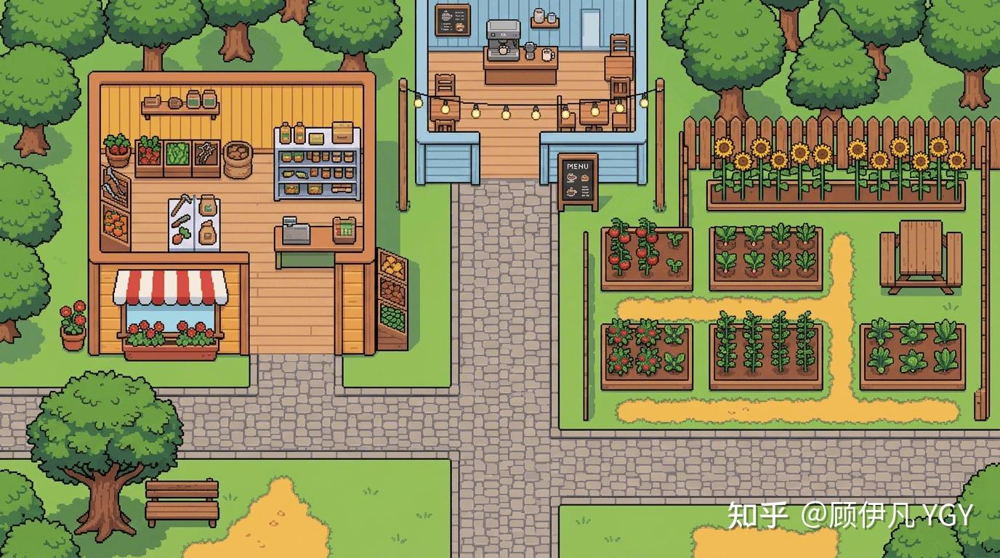
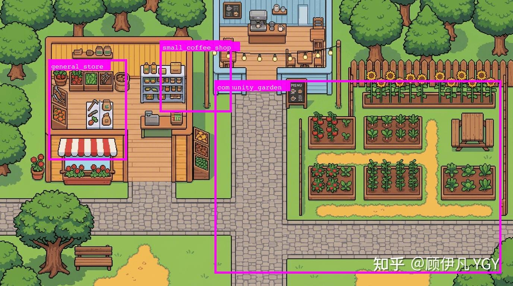
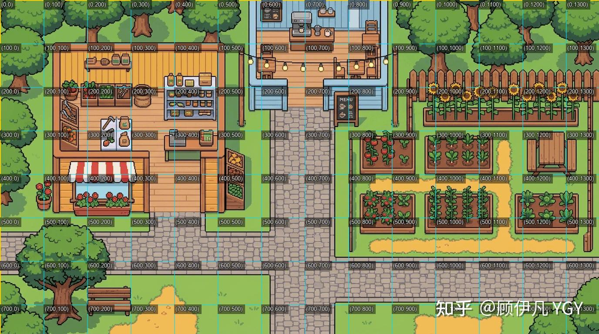
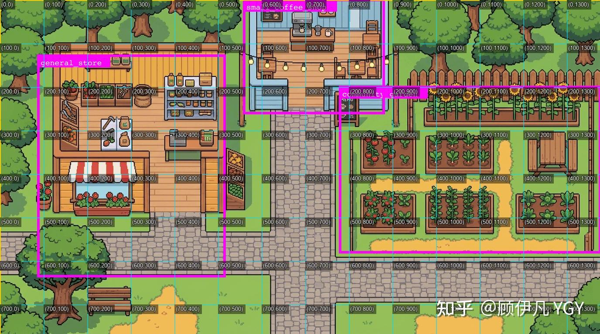
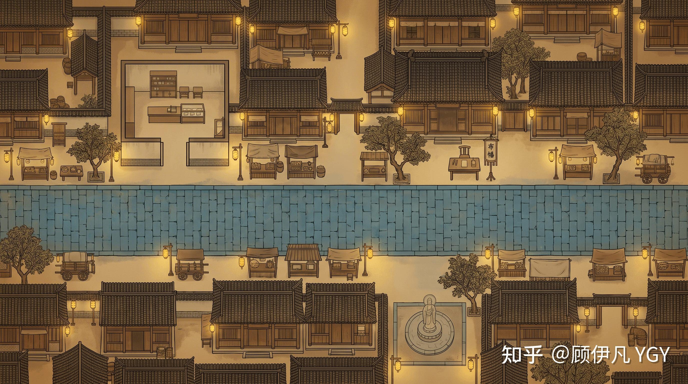
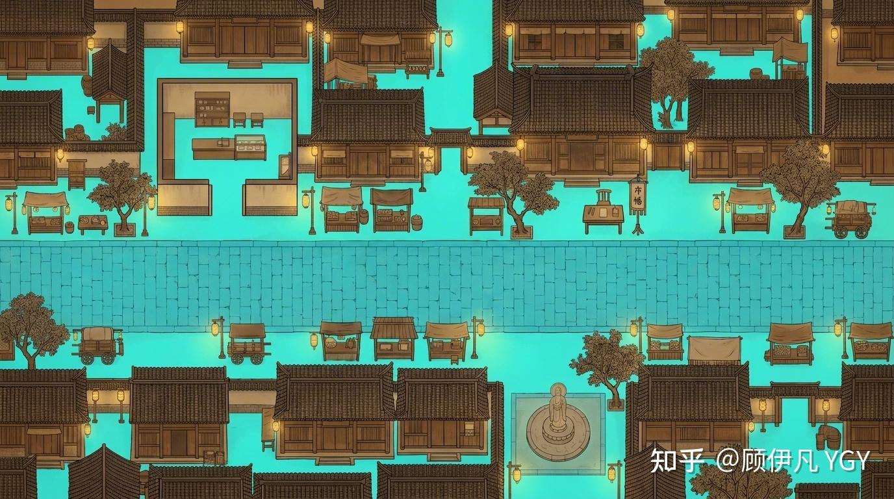
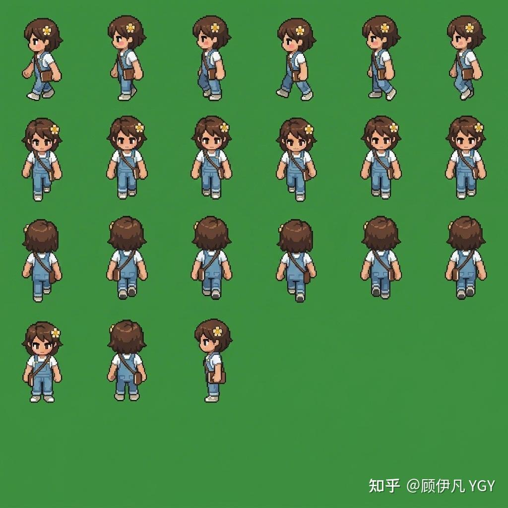

# WorldX 技术分享资料整理

> 分享主题建议：我用一句话生成了一个 AI 世界：从自动化构建到涌现叙事的产品技术思考
>
> 资料来源：
> - 作者技术文章：《我用一句话生成了一个AI世界 — 从自动化构建到涌现叙事的全栈技术解析》
> - 开源项目：WorldX，作者/项目方：顾n凡 YGY / YGYOOO
> - 仓库代码：当前本地项目 `WorldX`

## 0. 分享定位

这次分享不建议做成“从前端到后端逐行剖析实现”的源码讲解，而是讲作者在做 WorldX 时遇到的几个关键卡点，以及这些卡点背后的思考方式。

核心看点：

1. WorldX 不是只让 AI 角色在固定地图里生活，而是把“创造世界”本身也自动化。
2. 最有价值的不是“用了哪些模型”，而是作者如何把不稳定的生成式能力，拆成可约束、可审查、可计算的工程管线。
3. 地图生成/标注部分最值得展开，尤其是作者提出的洞察：图像生成模型不只是“会画图”，它可能具备很强的视觉理解能力，因为不理解就根本无法生成。
4. 项目中的很多设计都围绕一个目标：让 AI 世界既能自动生成，又能稳定运行，还能产生可观察的涌现叙事。

建议分享主线：

```text
固定 AI 小镇的瓶颈
  -> 一句话生成完整世界的目标
  -> WorldX 的四模块架构
  -> 地图生成为什么最难
  -> 从“让模型报坐标”到“让模型画答案”
  -> 角色动画、记忆反思、anchor、情绪等设计如何一起支撑涌现叙事
```

## 1. 项目介绍

### 1.1 WorldX 是什么

WorldX 是一个开源的 AI 社交模拟项目。用户输入一句自然语言描述，系统自动生成一个可运行的 AI 世界，包括地图、角色、交互规则和运行时模拟。

典型例子：

> “夜晚的宋朝繁华夜市，有当铺掌柜、算命先生、捕快、小偷、酒鬼，还有一个刚从现代穿越来的网红。”

系统会生成一个宋朝夜市地图，创建多个角色，并让这些角色在世界中自主活动、社交、记忆和反思。没有预先写好的剧本，后续故事由角色的持续决策和交互涌现出来。

项目关键词：

- AI Agents
- LLM
- Procedural Generation
- Simulation
- Emergent Narrative
- 一句话创造世界

### 1.2 作者为什么做这个项目

作者的起点是 2023 年斯坦福 Generative Agents 论文带火的“AI 小镇”方向。那类项目证明了一个有趣的方向：AI 角色可以在一个预设空间里生活、社交、形成记忆，并产生类似涌现行为的故事。

但作者观察到既有项目有一个共同瓶颈：

> 世界是固定的。

地图、角色、场景交互都需要人工搭建。想换一个世界，基本就要重新制作场景、配置角色、编排交互。作者想解决的是：不只是让 AI 角色在世界里自动行动，而是让“创造世界”这件事本身也自动化。

因此 WorldX 的目标可以概括为：

```text
一句自然语言描述
  -> 几分钟自动生成
  -> 一个完整的、可运行的、可被角色理解和交互的 AI 世界
```

与斯坦福 Generative Agents 的对比

|  | Stanford Generative Agents | WorldX |
| ----- | ----- | ----- |
| 世界 | 手工搭建的固定小镇 | 一句话自动生成，每次都不一样 |
| 地图 | 预制 Tiled 地图 | 多模态管线自动生成 + 自我审查 |
| 角色 | 预设固定角色 | AI 自动设计 + 自动生成角色样貌、动画 |
| 记忆检索 | Embedding 向量相似度 | 关键词 + 权重线性模型 |
| 自我修正 | 无 | 全链路审查→约束注入→重试循环 |
| 用户干预 | 有限 | 广播、记忆编辑、人设修改、架空对话 |
| 上手门槛 | 需要大量配置 | 配上 API Key 就行 |

简单来说——Generative Agents 证明了“AI 角色可以涌现出有趣的社会行为”，WorldX 在此基础上进一步回答了“怎么让任何人描述一句话就能拥有一个自己的 AI 世界”。


### 1.3 演示建议

分享开场适合先演示，不要先讲架构。

演示顺序建议：

1. 打开 WorldX 首页，展示一句话创建世界的入口。
2. 使用内置世界快速播放，避免现场等待完整生成。
3. 展示角色在地图上移动、对话、事件流、角色详情、上帝模式。
4. 如果时间允许，再展示创建页，让大家看到“输入一句话”的产品形态。

演示时重点解释：

- 这不是普通地图编辑器，也不是单纯聊天机器人。
- 这里生成的是“可运行的世界”：地图可走、区域有语义、角色有状态、事件会沉淀为记忆。
- 故事不是脚本播放，而是运行时 Agent 反复感知、决策、执行后的结果。

## 2. 项目整体技术全貌

### 2.1 四模块架构

WorldX 由四个模块构成，每个模块使用适合自己的模型能力。

| 模块 | 作用 | 模型角色 |
| --- | --- | --- |
| Orchestrator 编排器 | 把一句话展开成完整世界设计方案 | 强推理模型 |
| Generators 生成器 | 生成地图、角色素材、地图标注 | 图像生成模型 + 视觉审查模型 |
| Server 模拟引擎 | 驱动角色感知、决策、对话、记忆 | 高频、低成本 LLM |
| Client 游戏客户端 | 渲染世界、展示行为和交互 | Phaser 3 + React |

这套架构的关键不是“用了四个模型”，而是让不同模型承担不同工作：

- 推理模型负责结构化规划。
- 图像模型负责视觉生成和视觉标注。
- 视觉模型负责审查、定位、反馈。
- 轻量模型负责高频角色行为。

### 2.2 `world-design.json`：全系统合约

Orchestrator 的核心产物是 `world-design.json`。它是整个系统的合约，一次生成，多处消费。

它同时驱动：

- 地图生成：`mapDescription` 告诉图像模型画什么。
- 区域定位：`regions` 描述有哪些功能区。
- 交互元素定位：`interactiveElements` 描述有哪些物件。
- 角色生成：`characters` 定义角色外貌、人设、动机、初始记忆。
- 运行时模拟：`worldActions` 和各区域/物件 interaction 定义角色可做什么。

这点很适合在分享里强调：作者不是让每个环节各自发挥，而是先用结构化世界设计把后续生成和运行都约束住。

### 2.3 一句话到完整世界的结构化展开

当用户输入一句话后，系统先让 LLM 扮演“世界建筑师”，输出结构化蓝图。这里不仅是扩写设定，还包含很多工程边界：

- 世界名称、描述、语言。
- 地图描述和构图规划。
- 场景类型：开放场景或封闭场景。
- 时间配置：起止时间、显示格式。
- 功能区和交互元素：最多 8 个。
- 角色：最多 8 个。
- 全局动作和局部交互。

值得分享的几个设计点：

#### 可行性守门机制

系统不会对所有输入来者不拒。如果用户要求超出稳定上限，例如“生成 50 个角色的城市”，系统返回 `feasible: false`，并给出原因和调整建议。

这个设计的价值是产品层面的诚实：

- 不偷偷缩水。
- 不把失败伪装成成功。
- 把系统能力边界显式暴露给用户。

#### `mapDescription` 的少即是多

传给图像模型的地图描述不能写得过重。作者认为只需要告诉图像模型：

```text
这是什么地方 + 什么风格 + 一句构图要点
```

原因是图像模型本身知道怎么画。推理模型写太多渲染细节，反而可能干扰图像生成。

#### IP 角色处理

如果用户提到知名 IP 角色，系统会额外生成：

- `iconicCues`：标志性说话习惯、台词、小动作。
- `canonicalRefs`：原作中的关键关系、心结、执念。

但作者特别加入反脸谱化约束：IP 角色大部分时间应该像普通人一样生活，只有在被触发时才显露标志性一面。

这个设计可以作为“AI 角色鲜活度”案例：不是堆设定，而是控制设定出现的时机。

#### 角色锚定 anchor

不是所有角色都应该到处乱跑。店主、摊贩、掌柜这类角色需要绑定在某个区域或物件旁。

`anchor` 机制让角色绑定到：

- 某个功能区：如当铺掌柜待在当铺。
- 某个可交互元素：如摊贩守在摊位旁。

当某个交互被标记为 `requiresAnchor: true`，运行时会把物件交互转化为与锚定角色的对话。例如用户选择“买炊饼”，实际触发的是和摊主对话，而不是对着摊位执行一个孤立动作。

## 3. 重点：地图生成与地图标注

地图生成是最值得展开的部分，因为它集中体现了作者的工程思考：面对模型不稳定和坐标不精确，不是硬让 LLM 做它不擅长的事，而是重构问题。

### 3.1 问题定义：要的不是一张好看的图

WorldX 需要的地图不是普通背景图，而是游戏能运行的地图。

最终产物要同时满足：

- 一张好看的近俯视地图。
- 每个功能区有精确坐标。
- 每个可交互元素有精确坐标。
- 可行走区域能转成网格。
- 能拼装成 Tiled JSON，被游戏引擎直接加载。

这意味着问题不是“生成一张地图”，而是：

```text
生成一张可被代码理解、可被角色导航、可被运行时交互的地图
```

### 3.2 地图生成方法一：文生图模型直接生成地图

这是最自然的第一反应。既然文生图模型很强，直接生成一张游戏地图似乎可行。

优点：

- 美术效果好。
- 风格自由度高。
- 不依赖固定素材库。

问题：

- 很难保证所有道路连通。
- 容易出现动态元素，比如人物、车辆。
- 视角可能不稳定，透视/等距/俯视混杂。
- 遮挡关系不可控。
- 建筑内部不可见时，角色无法进入。
- 最关键的是：这只是一张图，没有区域、坐标、碰撞和语义。

作者最终没有放弃这条路线，因为它最符合 WorldX 对美术自由度和场景泛化能力的要求。但选择这条路线后，问题会被拆成两个层次：

- 相对简单的问题：视角、连通性、纯背景、遮挡等，可以通过约束和审查机制逐步收敛。
- 更难的问题：地图标注，也就是如何让一张图片变成有坐标、有语义、可寻路、可交互的游戏地图。




### 3.3 地图生成方法二：用基础素材自动搭建地图

这是传统游戏开发的路线：用 tile、组件、素材块拼装地图。理论上，它天然能产生结构化坐标和游戏语义。

优点：

- 坐标和结构天然明确。
- 可以直接生成游戏地图文件。
- 可插入碰撞、导航、交互信息。

问题：

- 素材库限制风格，地图容易趋同。
- LLM 直接输出复杂布局坐标不稳定。
- 要让 AI 理解每个 tile 的视觉含义很难。
- 拼图式地图美观度不如图像生成。
- 相关论文路线通常还需要微调、固定素材库、规则审查，工程成本很高。

作者的判断是：这个路线理论上限高，但短期不符合 WorldX 对美观和泛化的诉求。




这里可以讲一个很有价值的类比：

> AI 写网页强，是因为 HTML/CSS/DOM 的结构和效果是清晰的；AI 拼游戏地图难，是因为每个素材到底长什么样、拼起来是否自然，模型并没有稳定的内部表示。

### 3.4 选择文生图路线后：先解决相对简单的问题

作者回到文生图路线，但加入明确约束和审查闭环。

地图生成约束包括：

- 道路互相连通。
- 纯背景，不出现角色等动态元素。
- 接近俯视视角，不用透视或等距视角。
- 不允许严重遮挡主要路面。
- 可进入建筑采用横切视角，能直接看到内部结构。


然而，目前最强的文生图模型如nano banana2或gpt image 2依然无法确保一次性所有规则都准确生成，所以这里还需引入自我审查优化的机制，大致过程如下：  



审查流程：

1. 图像模型生成地图。
2. 交给视觉审查模型 review。
3. 审查模型输出结构化反馈。
4. 如果不通过，把反馈转成新约束。
5. 新约束追加到下一次 prompt，而不是替换原 prompt。
6. 多轮重试，约束逐步累积。

这个机制的关键点：

> 注意是追加不是替换——约束是累积的，每次重试都带着之前所有的经验教训，**这意味着每一轮生成都"记住"了之前的教训，约束越来越精确，使整个过程是逐步收敛的。**

这不是完美解决所有问题，但解决了地图生成中相对容易约束的一批问题。

### 3.5 更难的问题：地图标注

真正的难点是：如何让 AI 生成的图片变成有语义、有坐标、能被代码理解的地图。

需要标注的内容包括：

- 可行走区域：可被角色脚踩在上面的区域。  
- 可进入建筑/可交互区域：如菜园（种菜）、杂货店、咖啡厅。  
- 可交互元素：如喷泉（许愿、观赏）、咖啡机（做咖啡）、灶台。

地图标注问题下面有三条主要思路，它们是并列关系：

| 地图标注思路 | 核心做法 | 结论 |
| --- | --- | --- |
| 思路一：多模态大模型直接标坐标 | 看图后返回区域/元素坐标 | 能理解大致位置，但坐标精度不够 |
| 思路二：网格辅助 + 自我审查 | 给模型加“尺子”，再反复审查纠偏 | 建筑/物件勉强可用，但成本高，对大范围不规则区域仍困难 |
| 思路三：图像模型叠加标注 + 色差定位 | 让模型在图上涂色，再由程序算坐标 | 把视觉理解交给 AI，把精确计算交给 CV，最终可稳定落地 |

### 3.6 地图标注思路一：多模态大模型直接标坐标

最直观方案是让多模态大模型看图报坐标，但作者发现效果不够稳定。

我们拿一张小尺寸、结构简单的地图尝试一下：



我让gemini 3.1 pro识别图中的杂货店、咖啡厅和菜园，然后返回我每个区域的左上角和右下角坐标。

下面是标注结果。可以看到，它确实知道这些区域的大致方位，但离精确坐标还相去甚远：



其实这是预期中的结果，多模态大模型被训练出来不是为了识别坐标的，而是像人一样理解图片内容、理解图片中的结构关系，人也远远不可能肉眼看出坐标。


原因很重要：

> 多模态大模型擅长理解图片内容和结构关系，但并不是为了精确读像素坐标训练的。人也能看出“咖啡厅在左上”，但很难肉眼报出精确坐标。

### 3.7 地图标注思路二：网格辅助 + 自我审查

作者尝试给图片加网格，让模型有“尺子”可参考。

流程：

1. 给图片叠加坐标网格。
2. 多模态模型输出坐标。
3. 程序把坐标框画回图上。
4. 多模态模型审查标注是否准确。
5. 若不准，估算偏移并重新标注。

这个方案确实提升了准确性，但仍然有两个问题：

- 多轮审查 token 和时间成本高。
- 对大范围、不规则的可行走区域几乎不可解。

尤其是可行走区域，它不是几个矩形框能表示的，真实游戏地图往往需要几百上千个 tile 逐格判断。


既然大模型无法做到“我的眼睛就是尺”，那有什么方式可以提升它定位坐标的准确性呢？

那就让它用上尺子呗～可以给待标注的图片打上网格：



每个网格交叉点都是具体坐标值，有了这些参考线，大模型或许就行进行更准确的标注了。

然而现实很骨感：



采用此方法后，确实大幅提升了标注的准确性，但为了限制token消耗，我设置了审查优化的上限是5次


5次下依然很难做到标注正确，这还是比较简单的地图，复杂的地图所需要的次数上限多到难以估计，无论是token还是时间消耗都难以接受。

不过这个方案对于标注建筑、可交互元素等倒是理论上可以做到“勉强可用”了，但有一类标注，用此种方案几乎不可解——可行走区域标注，或者换句话说——**大范围的、不规则区域的标注**。

如果要实现稍微准确的标注，需要进行大量切分，可能上面这个简单的图就至少得用十几二十个长方形表示。  
而且实际上在真正的游戏地图中，是通过几百几千个16×16px或32×32px的小方块一点点把可行走区域（或“不可行走区域”）标注出来的。  


### 3.8 地图标注思路三：让图像生成模型“画出答案”

作者重新换了问题视角。

如果让人标注可行走区域，不一定会逐个报坐标。更自然的方法是拿笔在图上把能走的地方涂出来。然后程序比较原图和涂色图的色差，就能反推出所有坐标。

于是作者把这个思路迁移到大模型：

```text
不要让模型写坐标
让图像生成/编辑模型在原图上涂出区域
再用确定性的 CV 算法从色差中提取坐标
```

这就是“文生图模型叠加标注 + 色差定位”。

流程：

1. 输入原始地图。
2. 要求图像编辑模型用指定颜色和透明度标出目标区域。
3. 得到标注图。
4. 程序对比原图和标注图。
5. 根据色彩差异提取目标区域坐标或可行走网格。


上面的地图太简单了，这次我们换一个复杂点的地图出来：



这张图如果光是标注主路的部分，很简单，但显然可行走的区域远不止这点，结构错综复杂，用多模态模型标注的方式几乎不可能实现。

而如果我把它作为参考图，传给nanobanana等文生图模型，让它把所有可行走区域涂抹出来，给定好色值、透明度，然后就能得到惊人的效果：



所有可行走区域，被极其准确地标注了出来！

> 我觉得是因为文生图模型天然地就是为了生成图片的，所以它们对图片内容的理解能力相当之强，否则根本不可能生成复杂的图片。

然后通过一段固定的代码比较两个图片的色彩差就能定位所有坐标了。

这块还涉及到色偏匹配度、边缘处理、噪声过滤、窄走廊抢救、孤岛处理等诸多细节优化，此处不展开，核心思路就是“色差定位”。


这个方案的价值在于任务重构：

- AI 不擅长精确报坐标。
- AI 擅长理解哪里是路、哪里是建筑、哪里是物件。
- CV 擅长从像素差异里算坐标。

最终变成：

```text
AI 做视觉判断和标注
程序做精确计算
```

这是整个地图管线最值得分享的一句话：

> 生成式 AI 的不确定性输出，被转化成了确定性的 CV 计算。


> 通过这里的思考尝试可以得到一个核心洞察：  
> • **图像生成即视觉理解**。图像生成模型对图像内容的理解能力可能远超人们通常认为的，因为不理解就根本无法生成。  
> • 类似于文本是语言任务的输出格式，图像本身也可以作为视觉识别/分析任务的输出格式，甚至很多任务下可以得到远超常规多模态大模型的效果。常规大模型是“写”出答案，图像生成大模型是“画”出答案

  

> 4.29更新：刚发现谷歌[DeepMind](https://zhida.zhihu.com/search?content_id=273911001&content_type=Article&match_order=1&q=DeepMind&zhida_source=entity)刚发布的一篇论文核心思路跟我这里的思路不谋而合：[Image Generators are Generalist Vision Learners](https://link.zhihu.com/?target=https%3A//arxiv.org/abs/2604.20329)  
> （我开源时间更早一点点😄）


### 3.9 分享重点洞察：图像生成即视觉理解

作者在这里得到的核心发现：

> 图像生成即视觉理解。图像生成模型对图像内容的理解能力可能远超人们通常认为的，因为不理解就根本无法生成。

这句话可以作为整场分享的高潮。

可以这样展开：

- 我们通常把图像生成模型理解为“画图工具”。
- 但如果它能按照语义在原图上准确涂出可行走区域，说明它并不只是生成像素，而是理解了图像中的空间、物体、材质和可通行性。
- 传统多模态模型会“写出答案”，但图像生成模型可以“画出答案”。
- 对视觉任务来说，图像本身也可以是一种输出格式，而且在某些任务中比文字坐标更自然、更稳定。

这对产研分享很有启发：

> 不要只问“模型能不能直接给我要的结构化答案”，还可以问“能不能让模型用它最擅长的模态表达答案，再由程序把答案转成结构化结果”。

### 3.10 补充增强：多色彩划分

可行走区域可以用一种颜色标注，但功能区和交互元素需要知道对应关系。

作者的做法是：

- 给每个目标分配不同颜色。
- 让图像模型在原图上用不同颜色标注。
- 程序按颜色提取对应区域。
- 为了稳定，每次最多处理 4 个元素，分批标注。

代码侧也能看到这个约束：`MAX_BATCH_SIZE = 4`，并预设了 cyan、magenta、yellow、blue 四种颜色。

### 3.11 工程落地：从色彩覆盖到可行走网格

对于可行走区域，系统会把图像模型涂出的青色覆盖转成 0/1 网格。

核心判断：

- 青色覆盖会让 G/B 通道上升，R 通道变化较小。
- 程序逐 tile 检查强证据和弱证据。
- 满足覆盖阈值则判定可行走。

工程细节：

- 对窄走廊做“抢救”，避免一格宽通道被误杀。
- 只删除孤立可走噪点。
- 刻意不填充空洞，因为填洞会让可行走区域膨胀，角色可能走上桌子或墙。

这个部分适合补一句工程总结：

> 稳定性不是来自单个模型更强，而是来自生成、审查、差分、阈值、连通域、保守清理这些环节共同构成的闭环。

## 4. 角色动画生成

角色动画的目标是让地图上的角色能自然移动，而不是只显示一张静态头像。

### 4.1 方案一：首尾帧 + 视频模型

思路：

1. 文生图模型生成动画首帧和尾帧。
2. 视频模型补中间帧。

优点：

- 路线直观。
- 理论上可以生成更自然的动作。

问题：

- 动画稳定性难控。
- 多个角色之间动作风格难统一。
- 自我审查更难。
- 视频模型成本较高。

作者在极短时间内探索可行路径，因此没有优先深入这条路线。

### 4.2 方案二：生成分帧精灵图

思路：

- 让图像模型直接生成四方向行走动画的分帧图。
- 运行时按帧循环播放。

优点：

- 和游戏引擎的 sprite sheet 机制匹配。
- 不依赖视频模型。

问题：

- 每帧位置不一定对齐。
- 不同角色的动作幅度、大小、布局不一致。
- 切图时容易出错。

作者也尝试过给图像加网格，让模型对齐更好，但稳定性仍然不足。

### 4.3 最终方案：分帧精灵图 + 参考模板

地图标注给了作者一个经验：

> 凭空生成很难稳定；基于参考图做改绘，能获得更强的像素级约束。

最终做法：

1. 准备一张完美的参考分帧模板。
2. 模板中每一帧的动作、位置、尺寸都固定。
3. 图像编辑模型基于模板改绘为目标角色。
4. 生成后的图再做抠图和 sprite 元数据处理。



这个方案的优点：

- 帧布局稳定。
- 角色大小和位置一致。
- 多角色动画风格更统一。
- 稳定到可以省掉自我审查，降低 token 成本。

抠图细节：

- 使用边缘种子 BFS，而不是简单绿幕抠图。
- 只删除从图片边缘可达且接近背景色的像素。
- 避免角色衣服颜色接近背景时被误删。

这里可以和地图生成形成呼应：

> 地图标注和角色动画都体现了同一个经验：给图像模型一个强参考，让它在约束内改绘，而不是从零自由发挥。


## 6. 其他值得分享的特殊设计

### 6.1 可行性守门机制

系统明确设置稳定上限：

- 最多 8 个角色。
- 功能区和交互元素合计最多 8 个。

超出能力时返回不可行，而不是偷偷合并或删减。

可分享的产品启发：

> 生成式产品不一定要假装无所不能。把边界讲清楚，反而能减少用户落差，并让系统更稳定。

### 6.2 IP 角色的反脸谱化

对于 IP 角色，系统保存标志性特征和原作心结，但并不让角色时时刻刻表演标签。

核心原则：

- 90% 时间像普通人一样在新世界生活。
- 标志性一面只在真正被触发时显露。

这个设计避免了 AI 角色变成“口头禅复读机”。

### 6.3 角色锚定 anchor

anchor 机制解决的是世界合理性问题：

- 掌柜应该守在当铺。
- 摊贩应该在摊位旁。
- 店主不能到处乱跑，导致店铺无人。

更重要的是，它把物件交互变成了社会交互：

```text
买炊饼
  -> 不是和炊饼摊交互
  -> 而是和炊饼摊主对话
```

这让世界更像一个有人生活的场所，而不是一组按钮菜单。

### 6.4 锚定角色不能主动出击

锚定角色并不是完全不能对话，而是不能主动离开岗位找别人聊天。别人可以来找他。

这个限制有两个作用：

- 模拟真实社会角色，例如店主守店。
- 避免锚定角色离开后，区域或物件失去服务者。

### 6.5 情绪系统：Valence + Arousal

情绪不是简单的 happy/sad 标签，而是两个维度：

- Valence：情绪效价，正值积极，负值消极。
- Arousal：唤醒度，高值激动/紧张，低值平静/低落。

组合可以表达更多状态：

- 高 Valence + 高 Arousal：兴奋。
- 低 Valence + 高 Arousal：愤怒/焦虑。
- 高 Valence + 低 Arousal：满足/安宁。

工程上每个 Tick 情绪都会自然衰减，逐渐回到基线。

### 6.6 情绪只在明显波动时对外可见

角色不是“情绪透明人”。只有当情绪达到阈值时，其他角色才会感知到。

这点很细，但很重要：

- 更接近真实社交。
- 避免每个角色都读心。
- 让“看出别人不对劲”成为一种事件，而不是常态信息。

### 6.7 感知不是全知

角色做决策前，只会看到它应该能看到的信息：

- 当前地点。
- 同位置的其他角色。
- 可交互物件。
- 最近事件。
- 自己最近行为摘要。
- 明显可见的他人情绪。

这让涌现行为更可信。例如“小偷看到捕快在东边，于是往西边溜”，依赖的就是有限感知和粗粒度方位。

### 6.8 记忆与反思：遗忘不是 bug

作者对记忆系统有一个很好的产品/认知层思考：

> 人类也会遗忘，适当遗忘不是 bug，而是记忆迭代、重组、压缩、理解和泛化的前提。

这部分不需要单独展开成大章节，但适合作为“让 AI 角色更像人”的小巧思来讲。

如果角色什么都记住，反而不真实，也不利于长期运行：

- prompt 会越来越长。
- 旧信息会干扰当前决策。
- 角色缺少选择性关注。
- 故事不能自然沉淀重点。

每个角色有持续增长的记忆库，记忆类型包括 observation、conversation、experience、reflection、hearsay、dream 等。记忆不是纯文本，还包含重要性、情感效价、情感强度、关联角色、关联地点、衰减因子、访问次数、是否长期记忆等字段。

记忆检索没有使用 embedding，而是采用四维加权评分：

```text
score = relevance × 3
      + recency × 2
      + importance × 2
      + emotionalIntensity × 1
```

这里的取舍也很有分享价值：

> 在 Agent 系统里，可调试性比精度更重要。

如果角色总忘记重要的事，可以调高 importance；如果总沉浸过去，可以调高 recency。权重透明、行为可解释、改完能验证。

反思机制分两级：

- 微反思：每模拟小时触发，从近期记忆中提炼洞察，并可能调整角色情绪和当前关注焦点。
- 日终深度反思：一天结束时回顾当天经历，生成反思类记忆，并强化相关旧记忆，让它们更不容易遗忘。

可以这样收束：

> 反思不是一段总结文本，而是会反过来改变角色后续行为和记忆结构的机制。

### 6.9 Tick 循环与并行策略

WorldX 运行时按 Tick 推进。每个 Tick 大致经历：

1. 推进时间。
2. 被动状态更新。
3. 决策波。
4. 对话冲突消解。
5. 执行动作。
6. 并行执行对话。
7. 微反思。
8. 记忆评估异步入队。

并行策略：

- 决策用 `Promise.allSettled`，单个角色失败不拖垮全局。
- 对话可并行。
- 非对话动作串行，因为可能修改共享状态。
- 记忆评估异步，不阻塞主循环。

这部分可以轻讲，作为整体技术全貌的一部分。

## 7. 建议的前端页面结构

虽然最终可以做成 PPT，但这个内容其实更适合做成一个可滚动的前端技术分享页面：图片、对比表、流程图和关键洞察可以顺着叙事逐层展开，比普通分页 PPT 更容易承载“方案试错 -> 卡点突破”的故事线。

### 7.1 首屏：标题与一句话定位

标题建议：

> 我用一句话生成了一个 AI 世界

副标题：

> 从自动化构建到涌现叙事的 WorldX 技术解析

首屏可以放项目截图或演示图，使用文档中的开场图片：

- `images/001.jpg`
- `images/002.jpg`
- `images/003.jpg`
- `images/004.jpg`

### 7.2 为什么这个项目有意思：对比固定 AI 小镇

这一屏建议放表格，使用文档 1.2 中“与斯坦福 Generative Agents 的对比”。

|  | Stanford Generative Agents | WorldX |
| ----- | ----- | ----- |
| 世界 | 手工搭建的固定小镇 | 一句话自动生成，每次都不一样 |
| 地图 | 预制 Tiled 地图 | 多模态管线自动生成 + 自我审查 |
| 角色 | 预设固定角色 | AI 自动设计 + 自动生成角色样貌、动画 |
| 记忆检索 | Embedding 向量相似度 | 关键词 + 权重线性模型 |
| 自我修正 | 无 | 全链路审查→约束注入→重试循环 |
| 用户干预 | 有限 | 广播、记忆编辑、人设修改、架空对话 |
| 上手门槛 | 需要大量配置 | 配上 API Key 就行 |

页面表达重点：

- Generative Agents 证明了“AI 角色可以在固定世界里涌现社会行为”。
- WorldX 进一步解决“世界本身如何自动生成”。

### 7.3 项目演示：先看到世界跑起来

这里适合放内置世界截图或现场演示入口。

可以使用：

- `images/001.jpg` 到 `images/004.jpg`
- 或 README 中的 `docs/screenshot1.png`、`docs/screenshot2.png`、`docs/screenshot3.png`

讲解重点：

- 这不是普通地图编辑器，也不是单纯聊天机器人。
- 生成的是可运行世界：地图可走、区域有语义、角色有状态、事件会沉淀为记忆。

### 7.4 整体架构：四模块协作

这一屏放四模块架构图，直接使用作者文档中的：

- `images/005.jpg`

文字结构：

```text
用户一句话
  -> Orchestrator: 生成 world-design.json
  -> Generators: 地图/角色/标注
  -> Server: Agent 运行时
  -> Client: 可视化与交互
```

这里把 `world-design.json` 放在 Orchestrator 里一起讲，不再单独做一页。

讲法：

- Orchestrator 的核心产物是 `world-design.json`。
- 它是全系统合约：地图、区域、角色、动作、运行时都从这里消费信息。
- 这让后续模块不是各自发挥，而是围绕同一个结构化蓝图协作。

### 7.5 地图生成为什么难

难点不是生成背景图，而是生成可运行地图。

需要：美术、语义、坐标、可行走网格、Tiled JSON。

这一屏可以先放一句：

> WorldX 要的不是一张好看的图，而是一张能被代码理解、能被角色导航和交互的地图。

### 7.6 地图生成的两条路线

对比两种地图生成方法：

| 方案 | 优点 | 问题 |
| --- | --- | --- |
| 直接文生图 | 美观、自由 | 无坐标、不可控 |
| 素材拼装 | 结构明确 | 风格受限、复杂、难美观 |

配图建议：

- 直接文生图效果：`images/006.jpg`
- 直接文生图问题示意：`images/007.jpg`
- 素材堆积/World Craft 相关：`images/008.jpg`、`images/009.jpg`

讲解结论：

- 素材堆积路线理论上结构化更强，但美术上限和泛化能力不符合作者诉求。
- 作者最终选择文生图路线，再把问题拆成难易两类。

### 7.7 选择文生图后：简单问题用审查机制收敛

这一屏讲“文生图 + 约束 + 自我审查”。

配图：

- `images/010.jpg`

表达重点：

- 连通性、纯背景、俯视视角、少遮挡、可进入建筑横切视角等问题，先通过 prompt 约束处理。
- 文生图模型不能保证一次成功，所以用视觉审查模型 review。
- 审查反馈不是替换 prompt，而是追加为新约束，让每轮生成逐渐收敛。

### 7.8 更难的问题：地图标注

这一屏引出真正卡点：

多模态模型能看懂图，但很难报精确坐标。

尤其是大范围不规则可行走区域。

可以先展示思路一的失败：

- 原图：`images/011.jpg`
- 多模态坐标标注结果：`images/012.jpg`

### 7.9 地图标注三种思路对比

这一屏放并列表格：

| 地图标注思路 | 配图 | 结论 |
| --- | --- | --- |
| 思路一：多模态大模型直接标坐标 | `images/011.jpg`、`images/012.jpg` | 能识别大致位置，但坐标不准 |
| 思路二：网格辅助 + 自我审查 | `images/013.jpg`、`images/015.jpg` | 有提升，但 5 次审查仍不够，成本不可接受 |
| 思路三：图像模型叠加标注 + 色差定位 | `images/016.jpg`、`images/017.jpg` | 让模型画答案，程序算坐标，效果显著 |

### 7.10 关键突破：不让模型写坐标，让模型画答案

标题建议：

> 不让模型写坐标，让模型画答案

流程：

```text
原图
  -> 图像模型叠加彩色标注
  -> 色差定位
  -> 坐标/网格
```

配图：

- 复杂原图：`images/016.jpg`
- 可行走区域涂色结果：`images/017.jpg`

讲解重点：

- AI 不擅长精确报坐标。
- AI 擅长理解哪里是路、哪里是建筑、哪里可走。
- CV 擅长从像素差异里算坐标。
- 生成式 AI 的不确定性输出，被转化为确定性的 CV 计算。

### 7.11 核心洞察：图像生成即视觉理解

大字展示：

> 图像生成即视觉理解。

解释：

- 图像模型能画出哪里可走，说明它理解了空间。
- 图像本身可以作为视觉任务的输出格式。
- 让 AI 做判断，让程序做计算。

可以继续放多色彩标注图作为延展：

- `images/018.jpg`
- `images/019.jpg`

### 7.12 角色动画生成

路线对比：

- 视频模型：贵、不稳定、不易审查。
- 直接生成 sprite sheet：帧对齐不稳定。
- 参考模板改绘：布局稳定、成本可控。

配图：

- `images/020.jpg`

讲解重点：

- 角色动画不是只要生成四向图，还要能动起来。
- 直接生成分帧图存在对齐和一致性问题。
- 最终用参考模板约束动作、位置和尺寸，让图像模型在模板上改绘。

### 7.13 其他让世界更可信的小巧思

这一屏不单独讲记忆与反思，而是把它作为小巧思之一放进列表：

- 可行性守门。
- IP 角色反脸谱化。
- anchor 机制。
- 记忆与反思：遗忘不是 bug。
- 情绪双维度。
- 情绪只在明显波动时可见。
- 感知不是全知。

### 7.14 总结

WorldX 的启发：

1. 把生成式能力放进可收敛的工程闭环。
2. 不要强迫模型输出它不擅长的格式。
3. 让模型用最擅长的模态表达，再用程序转结构。
4. 涌现叙事不是只靠 LLM，而是世界结构、记忆、感知、情绪和交互共同作用。

## 8. 分享时可以重点讲的金句

- WorldX 想解决的不是“让 AI 在世界里行动”，而是“让创造世界本身自动化”。
- `world-design.json` 是整个系统的合约，一次生成，多处消费。
- 地图生成最难的地方不是画得好看，而是让它能被代码理解。
- 多模态模型能看懂图，但不等于能稳定报出精确坐标。
- 不让模型写坐标，让模型画答案。
- 图像生成即视觉理解。
- 图像本身也可以是视觉分析任务的输出格式。
- 生成式 AI 的不确定性输出，可以被转化成确定性的 CV 计算。
- 稳定性来自模型能力、约束、审查和传统算法的组合。
- 遗忘不是 bug，是角色长期演化的 feature。
- 好的 Agent 不是全知全能，而是在有限感知、有限记忆和有限情绪表达中做选择。

## 9. 可以补充展示的项目文件

如果后续做 PPT/页面，可以按需引用这些文件作为技术佐证：

- `README.md`：项目介绍、特性、运行方式。
- `orchestrator/prompts/design-world.md`：世界设计 schema、可行性守门、anchor、IP 角色规则。
- `generators/map/src/utils/overlay-extraction.mjs`：多色彩标注、色差定位、批量大小。
- `generators/map/src/utils/image-utils.mjs`：可行走网格计算、青色证据、窄走廊抢救、保守清理。
- `server/src/core/memory-manager.ts`：记忆检索权重、衰减、巩固。
- `server/src/core/emotion-manager.ts`：Valence/Arousal 情绪模型与自然衰减。
- `server/src/simulation/action-menu-builder.ts`：`requiresAnchor` 如何转化为与锚定角色的对话。
- `server/src/simulation/simulation-engine.ts`：Tick 循环、并行决策、微反思、日终反思。
