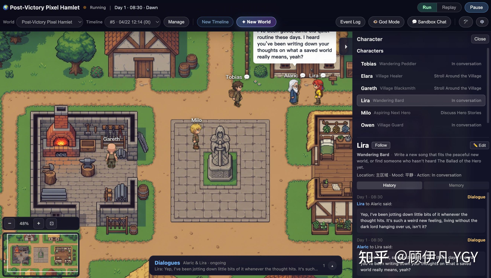
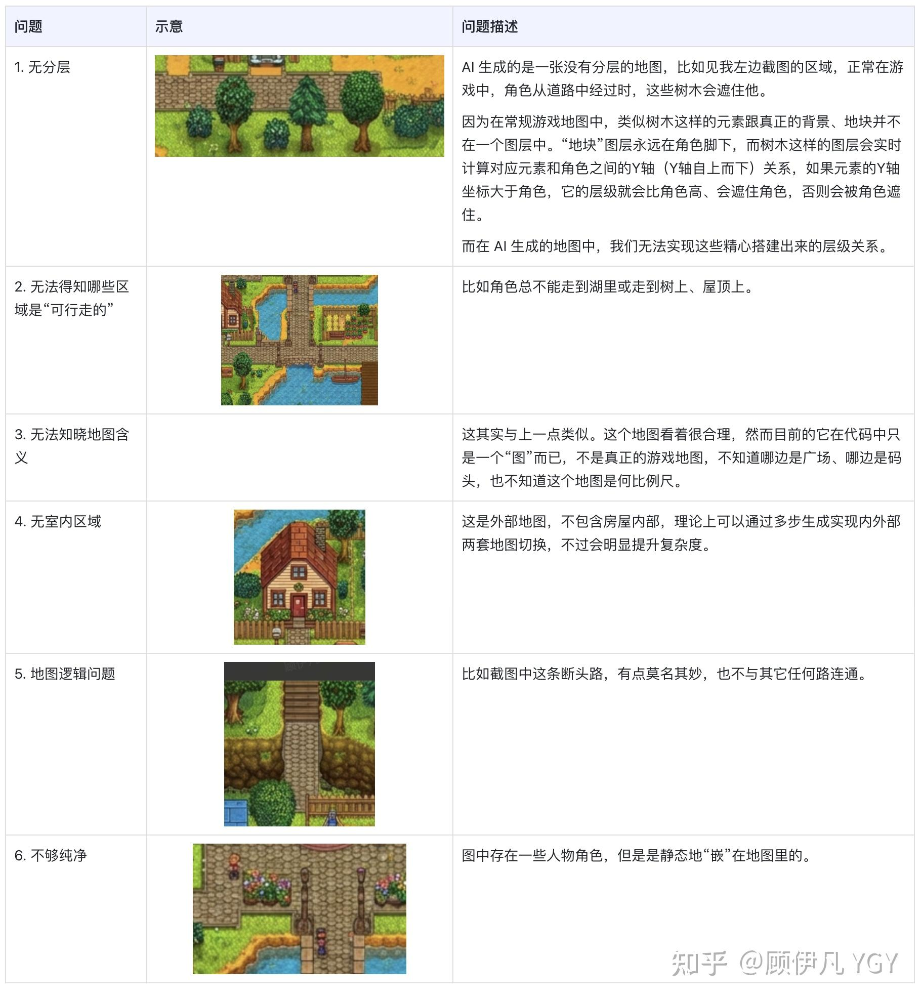
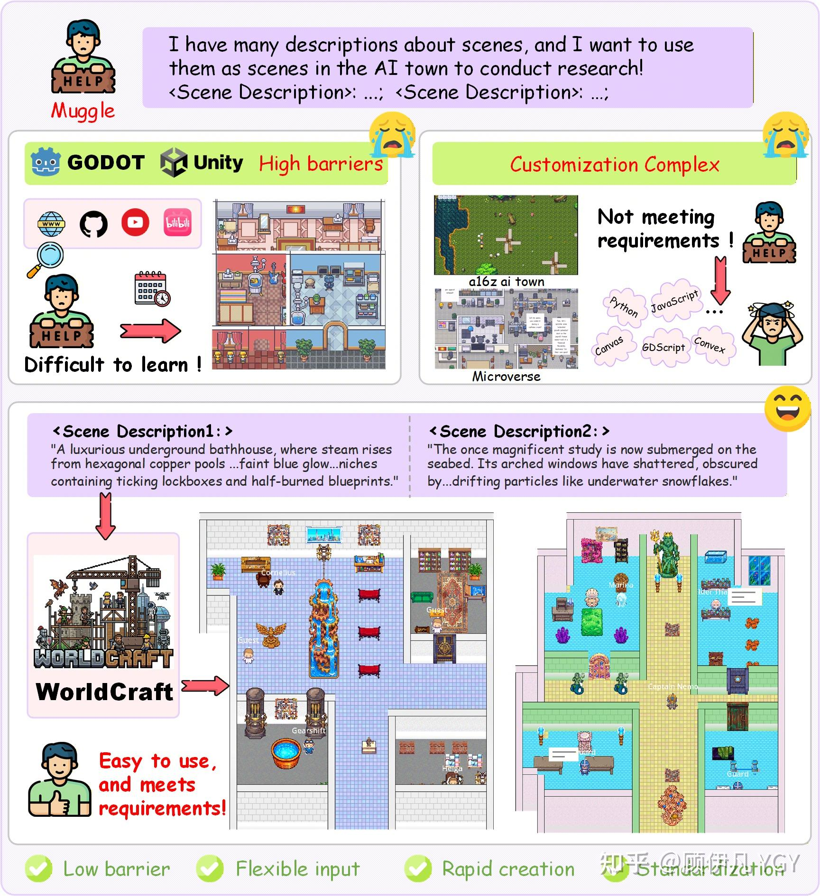
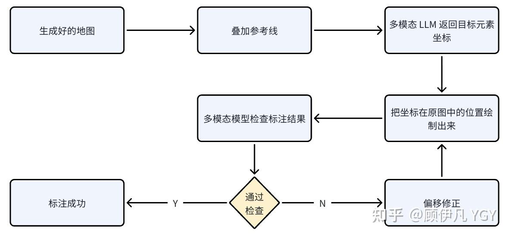
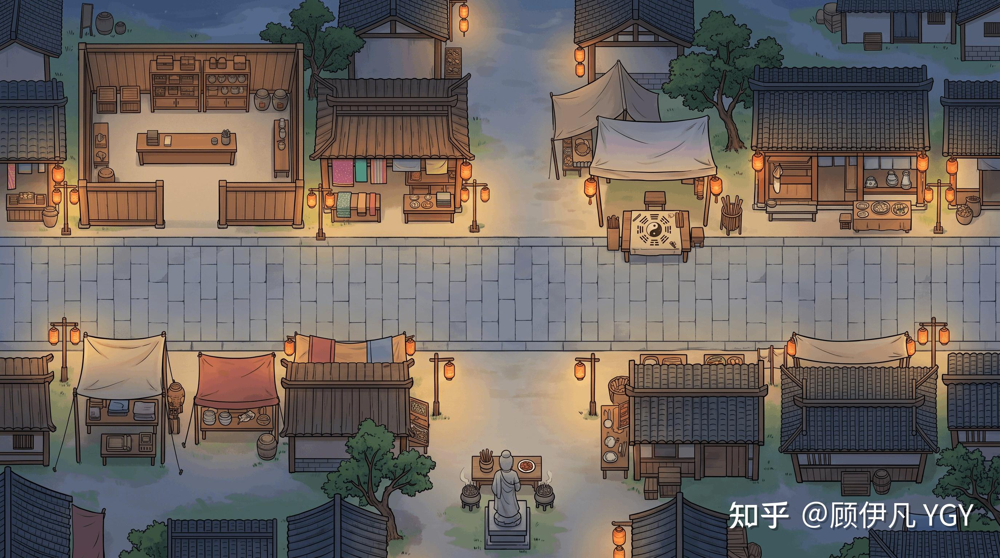
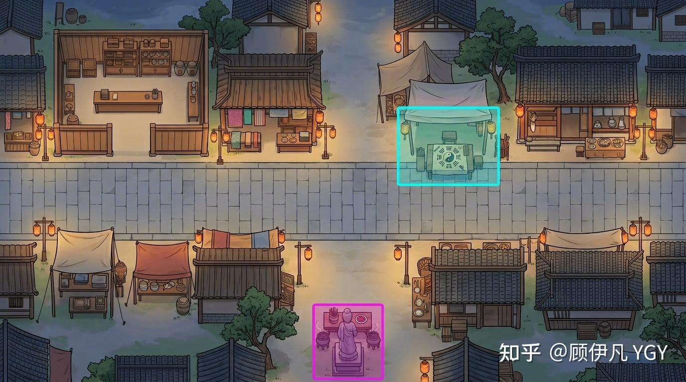
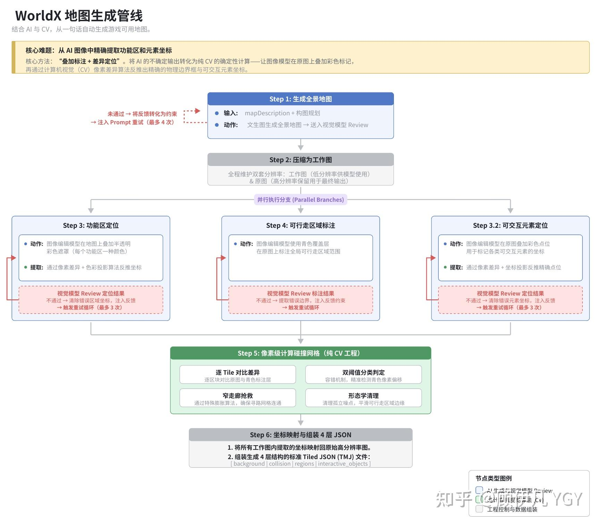
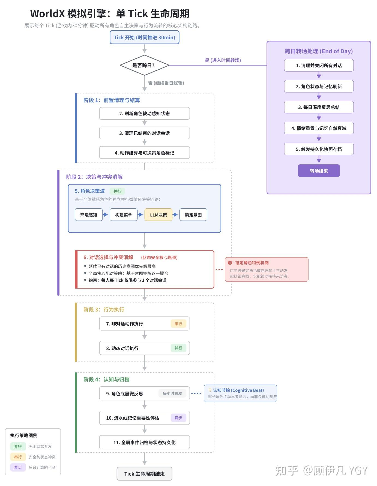
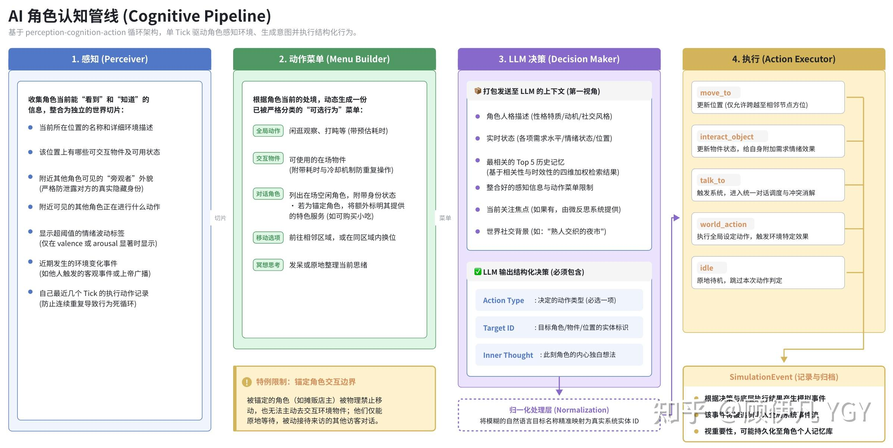

## 一、30秒介绍这是什么项目

输入一句话——比如“夜晚的宋朝繁华夜市，有当铺掌柜、算命先生、捕快、小偷、酒鬼，还有一个刚从现代穿越来的网红”——然后等个几分钟、消耗几万token：

一个宋朝夜市就出现了。6 个角色自己开始活动——当铺掌柜守着柜台念叨被偷的事，算命先生等客上门，捕快四处打听，小偷装作路人混在人群里，酒鬼醉醺醺地从街头晃到街尾，而穿越来的网红——飘逸的长发、衣着和旁人格格不入——正被所有人好奇地打量着。

没有人写过剧本，接下来发生的一切，完全由 AI 角色自主决定。  



**现已开源：**[https://github.com/YGYOOO/WorldX](https://link.zhihu.com/?target=https%3A//github.com/YGYOOO/WorldX) **👏欢迎star尝鲜～**

### 1.1 为何要做这个项目

2023 年，斯坦福的 [Generative Agents](https://link.zhihu.com/?target=https%3A//arxiv.org/abs/2304.03442) 论文让“AI 小镇”这个概念火了起来。AI 角色们在一个预先搭建好的小镇里自主生活、社交、形成记忆，展现出令人惊叹的“涌现行为”。此后，沿着这个方向诞生了很多热门项目，比如[http://github.com/a16z-infra/ai-town](https://link.zhihu.com/?target=http%3A//github.com/a16z-infra/ai-town)、[http://github.com/KsanaDock/Microverse](https://link.zhihu.com/?target=http%3A//github.com/KsanaDock/Microverse)，——但它们都有一个共同的瓶颈：  
**世界是固定的。** 场景和角色需要人工绘制/搭建，场景交互需要逐一编排。你想换一个场景？对不起，从头来过。  
我想解决的正是这个问题：**让“创造世界”本身也自动化**。它叫做“WorldX”。  
一句自然语言描述 → 5 分钟 → 一个完整的、可运行的 AI 世界。地图、角色、交互规则，全部自动生成。  
这篇文章会深入拆解 WorldX 是怎么做到的——从世界生成的多模态编排管线，到 AI 角色自主演绎的运行时引擎，再到大量细节上的工程挑战。

## 二、架构总览

先看个全景。WorldX 有四个模块，分别由四种 LLM 各司其职：

| 模块 | 干什么 | 用什么模型 |
| ----- | ----- | ----- |
| Orchestrator（编排器） | 把一句话展开成完整的世界设计方案 | 强推理模型 |
| Generators（生成器） | 画地图、画角色 | 绘图模型 + 视觉审查模型 |
| Server（模拟引擎） | 驱动角色决策、对话、记忆 | 轻量模型（调用频率高，得便宜） |
| Client（游戏客户端） | 渲染世界、展示行为、用户交互 | — |

有一个贯穿整个系统的设计——Orchestrator 产出的 `world-design.json` 充当了全系统的“合约”。这一份 JSON 同时驱动地图生成（`mapDescription` 告诉绘图模型画什么）、区域定位（`regions` 描述功能区在哪）、角色生成（`characters` 定义外貌和人设）、运行时模拟（`worldActions` 定义可用动作）。一次 LLM 调用生成的数据，从头用到尾，不需要人工编辑。


## 三、卡点问题攻破

其实项目初始我就思考并列举了几大卡点问题，这些问题任何一个若没有较好的解决方法，最终都会导致最终项目效果大打折扣甚至完全无法实现。  
所以我一开始的目标就是解决这些问题，下面也会顺着我当时的解决思路逐层展开：

### 3.1 地图生成

**3.1.1 思路1：文生图模型直接生成**  
这是很容易想到的思路，毕竟现在文生图模型已经比较强大了，区区生成一个游戏背景图岂不是轻轻松松？  
比如现在我刚生成了一张星露谷物语风格的地图：


  
然而稍微深入后就会发现这其中存在大量问题，其中部分问题很难解决：



**3.1.2 思路2：通过基础素材进行自动搭建**

既然思路1很难行得通，那自然地就会想到这个思路，这也是常规开发游戏时的方式：通过基础的素材块一点点搭建出完整的游戏地图，由于是逐步搭建出来的，所以在搭建过程中就可以注入各类地图含义信息，最终直接形成含标注的真正的“游戏地图”。

而我们都知道，目前ai coding的能力是很强的，能够从0生成非常美观的且具一定复杂度的页面，那是不是从基础素材搭建出完整地图也不在话下？  
实际上也确实有学术界做了类似方向的工作。

**盛大 AI 研究院、上海 AI Lab的研究**

盛大 AI 研究院、南开、复旦、上海 AI Lab 等机构发表了“[World Craft](https://zhida.zhihu.com/search?content_id=273911001&content_type=Article&match_order=1&q=World+Craft&zhida_source=entity)”（[arXiv 2601.09150](https://link.zhihu.com/?target=https%3A//arxiv.org/abs/2601.09150)）。



它的大致方式是：

1.  [World Guild](https://zhida.zhihu.com/search?content_id=273911001&content_type=Article&match_order=1&q=World+Guild&zhida_source=entity)（多智能体协作框架）：将模糊的文本指令转化为精确的场景布局。该系统由四个核心智能体协作 ：

1.  [Enricher](https://zhida.zhihu.com/search?content_id=273911001&content_type=Article&match_order=1&q=Enricher&zhida_source=entity)（语义增强）： 将用户的粗略描述转化为包含空间逻辑的场景拓扑
2.  Manager（约束布局生成）： 将拓扑逻辑映射为精确的几何坐标和组件属性 。
3.  [Critic](https://zhida.zhihu.com/search?content_id=273911001&content_type=Article&match_order=1&q=Critic&zhida_source=entity)（迭代优化）： 进行规则检查（如碰撞、连通性）并提出修正建议，确保物理合理性 。
4.  [Artist](https://zhida.zhihu.com/search?content_id=273911001&content_type=Article&match_order=1&q=Artist&zhida_source=entity)（资产合成）： 利用检索增强策略，确保生成的视觉资产风格统一且符合语义 。

2\. [World Scaffold](https://zhida.zhihu.com/search?content_id=273911001&content_type=Article&match_order=1&q=World+Scaffold&zhida_source=entity)（标准化脚手架）： 作为一个基础设施，它能自动根据 World Guild 生成的结构化内容构建出可运行的游戏场景，包含导航网格和交互逻辑 。

然而这个方式存在一些弊端：

1.  只支持室内场景——论文 Limitations 里自己写了："Current generation primarily focuses on indoor environments within single scenes (e.g., residences, offices, or interiors of single buildings)"，不支持室外、街道、开放世界
2.  地图风格趋同——从一个 5500+ 素材的预制 tile 库里检索匹配的素材，拼装成地图。所有地图长得差不多，都是标准 RPG 像素风
3.  LLM 直接输出坐标可能不稳定——让 LLM 生成每个物件的网格坐标（虽然用了 12 区域策略和微调来提升准确性，但可能仍不足以保证稳定）
4.  需要微调模型——在 Qwen3-8B/32B 上做了两阶段 SFT，用 14k 样本训练，8 张 H200 跑的
5.  只生成场景布局——不包含角色生成、不包含模拟引擎，只输出一个 JSON 布局文件
6.  审查是规则检查——碰撞检测、连通性检测这些是程序化规则，不是视觉模型看图审查（所以只能确保结构不出错，但无法确保是否布局合理）
7.  不够美观


  

这个方法的理论上限会很高，但且不说别的（比如这个方法相当繁杂），这样生成的地图的美观度是达不到我诉求的。

为何ai搭地图远难于ai写网页，我觉得是因为它们有几个本质区别：

-   大模型公司会专门针对web开发等常见代码做专门训练，使其能很好的理解网页结构，而素材搭建不行
-   从素材搭建出游戏地图的结构复杂度超过了网页dom
-   大模型无法真正准确地得知每个素材到底“长什么样”，而每个html元素和css的样式是明确的

所以我决定还是回到思路1，尝试逐一攻破各个问题

**3.1.3 思路3🌟：思路1+约束+自我审查（先快速解决最好解决的问题）**

> 这一步是用最简便的手段解决思路1中最好解决的问题，较难解决的问题会在下文继续展开。

分析后可以发现，上面的问题1、4、5、6都可以被归类为一类问题，可以通过在生成地图时增加约束绕过这类问题。大致约束如下：

1.  连通性：确保地图中的所有道路之间必须是互相连通的，不能有孤岛区域（除非用户的要求中包含孤岛）
2.  纯背景：确保地图必须是静态的纯背景图，不能有角色等动态元素在其中
3.  俯视视角：地图必须是接近俯视的视角，不能是透视视角、等距（isometric）视角。（接近俯视的视角可以规避大量不同层级元素间的遮挡问题。这其实是对问题做了简化，其实我也研究过用 AI 真正实现分层地图的方法，但在稳定性上还需要更多研究，有机会后续再分享，这块不是本文重点）
4.  无严重遮挡：树木、墙壁等不能完全遮住主要路面导致角色完全“不可走”。（这个处理方式与上一条类似，本质都是把地图降维）
5.  建筑为横切视角：所有“可进入建筑”，必须为横切一刀的视角，就是能在地图上直接看见房屋内部结构。（这块其实也容易做成室内室外切换镜头的模式，但这个项目核心是一览所有角色的行为而不是常见游戏中的单角色视角，所以这种方式其实更适合，大部分类“AI小镇”项目也是这么处理的）

然而，目前最强的文生图模型如nano banana2或gpt image 2依然无法确保一次性所有规则都准确生成，所以这里还需引入自我审查优化的机制，大致过程如下：  


通过专门用于视觉审查的多模态 LLM，审查生成的地图是否符合约束， 若没通过，会把把审查反馈转成 Prompt 约束，**追加**到下一次 Prompt 里重新生成。

注意是追加不是替换——约束是累积的，每次重试都带着之前所有的经验教训，**这意味着每一轮生成都"记住"了之前的教训，约束越来越精确，使整个过程是逐步收敛的。**

**3.2 地图标注**

从这里开始就是本文的重头戏之一了，如何让 AI 生成的“地图”不再是无含义的“纯背景”，如何让它成为每个区域都有含义的、有精确坐标的、能被代码理解的真正“地图”。

**3.2.1 思路1：多模态大模型标注**

这是最直观的方案，既然多模态大模型的识图能力已经很强了，做个地图标注可不轻轻松松？  
然而完全不是这样。

我们需要得到的是所有可行走区域、各个可进入建筑/可交互元素的**精确坐标**，而不是“地图上有没有xx”或“xx的大致方位”。

> “可行走区域”：可被角色脚踩在上面的区域。  
> “可进入建筑/可交互区域”：如菜园（种菜）、杂货店、咖啡厅。  
> “可交互元素”：如喷泉（许愿、观赏）、咖啡机（做咖啡）、灶台。

我们拿一张小尺寸、结构简单的地图尝试一下：


我让gemini 3.1 pro识别图中的杂货店、咖啡厅和菜园，然后返回我每个区域的左上角和右下角坐标。

下面是标注结果。可以看到，它确实知道这些区域的大致方位，但离精确坐标还相去甚远：


其实这是预期中的结果，多模态大模型被训练出来不是为了识别坐标的，而是像人一样理解图片内容、理解图片中的结构关系，人也远远不可能肉眼看出坐标。

**3.2.2 思路2：思路1+网格辅助+自我审查**

既然大模型无法做到“我的眼睛就是尺”，那有什么方式可以提升它定位坐标的准确性呢？

那就让它用上尺子呗～可以给待标注的图片打上网格：


每个网格交叉点都是具体坐标值，有了这些参考线，大模型或许就行进行更准确的标注了。

另外很显然，在“地图生成”阶段用到的“自我审查”机制在这里依然可以用到：

1.  多模态大模型标注坐标
2.  基于坐标把当前标注的区块绘制出来（就是上面那张有粉色框框的图）
3.  多模态大模型审查上一轮标注是否准确
4.  若不准确，估算偏移值，然后基于偏移值重新标注

如此往复直至不断逼近正确错标。



然而现实很骨感：


采用此方法后，确实大幅提升了标注的准确性，但为了限制token消耗，我设置了审查优化的上限是5次

> 至于为什么限制审查次数，因为我希望这最终能成为一种普惠的、“人人可用”的架构，在一线大模型厂商不断涨价、限流、砍权益的情况下，更加具了我对这一点的坚持（当然还有个原因是我钱不够）

5次下依然很难做到标注正确，这还是比较简单的地图，复杂的地图所需要的次数上限多到难以估计，无论是token还是时间消耗都难以接受。

不过这个方案对于标注建筑、可交互元素等倒是理论上可以做到“勉强可用”了，但有一类标注，用此种方案几乎不可解——可行走区域标注，或者换句话说——**大范围的、不规则区域的标注**。

如果要实现稍微准确的标注，需要进行大量切分，可能上面这个简单的图就至少得用十几二十个长方形表示。  
而且实际上在真正的游戏地图中，是通过几百几千个16×16px或32×32px的小方块一点点把可行走区域（或“不可行走区域”）标注出来的。  
似乎在“地图标注”这点上必须要人工介入？难道是这点卡住了之前所有想要“一句话生成AI世界”的人？  
甚至我问了所有顶尖模型，给出的全是错误的方案。  
还有别的可能吗？🤔  
  
  
让我们从刚才的视角中抽离出来，重新站在“人”自己的角度思考一下这个问题。  
如果要让你把地图上所有可行走区域的坐标标注出来，你会怎么做？一种比较笨的方法是用尺子一点点量，但这又回到上面的思路中了。  
然而，虽然你无法一眼看出各个坐标，但你显然能一眼看出地图中哪些位置可走/不可走呀。  
所以能不能，在已经生成的地图的基础上，用水彩笔快速把可行走区域涂出来？（这连小孩子都擅长）然后把原始图片和你涂抹后的图片做一个色彩差值比较，得到坐标。比如某个坐标的像素，前后色值一样，说明没被标注，否则就说明被标注了。这样你就能通过一段固定代码得到这两张图中“可行走区域”的全部坐标了！  
那这个方法能否也用在大模型上呢？

**3.2.3 思路3**🌟**：文生图模型叠加标注+差值定位**

显然，大模型和人一样，能相对比较清楚的识别出“什么地方可走，什么地方不可走”，只是不知道精确坐标而已，那如何能让他“在原图的基础上涂抹”呢？没错，还是用文生图大模型。

**用文生图大模型识别文生图大模型生成的图片中的坐标**，这乍一听有点违和，但有了上面的思考，就很容易认识到这相当合理。

上面的地图太简单了，这次我们换一个复杂点的地图出来：


这张图如果光是标注主路的部分，很简单，但显然可行走的区域远不止这点，结构错综复杂，用多模态模型标注的方式几乎不可能实现。

而如果我把它作为参考图，传给nanobanana等文生图模型，让它把所有可行走区域涂抹出来，给定好色值、透明度，然后就能得到惊人的效果：


所有可行走区域，被极其准确地标注了出来！

> 我觉得是因为文生图模型天然地就是为了生成图片的，所以它们对图片内容的理解能力相当之强，否则根本不可能生成复杂的图片。

然后通过一段固定的代码比较两个图片的色彩差就能定位所有坐标了。

这块还涉及到色偏匹配度、边缘处理、噪声过滤、窄走廊抢救、孤岛处理等诸多细节优化，此处不展开，核心思路就是“色差定位”。

  

> 通过这里的思考尝试可以得到一个核心洞察：  
> • **图像生成即视觉理解**。图像生成模型对图像内容的理解能力可能远超人们通常认为的，因为不理解就根本无法生成。  
> • 类似于文本是语言任务的输出格式，图像本身也可以作为视觉识别/分析任务的输出格式，甚至很多任务下可以得到远超常规多模态大模型的效果。常规大模型是“写”出答案，图像生成大模型是“画”出答案

  

> 4.29更新：刚发现谷歌[DeepMind](https://zhida.zhihu.com/search?content_id=273911001&content_type=Article&match_order=1&q=DeepMind&zhida_source=entity)刚发布的一篇论文核心思路跟我这里的思路不谋而合：[Image Generators are Generalist Vision Learners](https://link.zhihu.com/?target=https%3A//arxiv.org/abs/2604.20329)  
> （我开源时间更早一点点😄）

**3.2.4 思路4🌟：思路3+多色彩划分**

以上方式可以说几乎完美地解决了“标注可行走区域”的问题，但建筑、可交互元素...当然也可以标，可标出来后应该如何知道它们的对应关系呢？比如某个地图中喷泉、雕像、座椅都被标注为了可交互元素，通过色差定位也能知道它们的具体坐标，但应该如何知道哪个坐标才是喷泉？

没错，可以用不同颜色来区分，下方右图就是nanobanana在原图基础上叠加生成的标注图：



（由于我找不到前面那张图当时标注时的中间态图片了，所以生成了一个新的图代替。这里只展示“可交互元素”的标注，不展示区域标注（比如左上角的屋子），原理类似）

另外，为了避免色彩过多导致不稳定，我限制了每次最多标注4个元素，最开始时“Orchestrator（世界编排器）”会构思好地图中一共有多少元素，然后到了这一步就4个4个地标。

### 3.2 角色动画生成

还有一个要解的问题就是如何生成地图中可活动的角色，如果只是生成角色的四向图（面朝上/下/左/右），是比较简单的，但如何让他们能动起来？一种偷懒的方式是“用跳跃代替走路”，就是角色走路时的动画就是它在地图上跳跃，有些主场景不是大地图的游戏在展示大地图时确实有这么处理的，但我们只有一张地图，也这么处理的话效果有些差，必须想办法生成行走动画。

**3.2.1 思路1：文生图模型生成首尾帧+视频模型生成动画**

这是比较直接的思路，我们只要用文生图模型生成整个动画完整的首尾帧，然后用视频模型“脑补”中间的部分生成动画就行了。

这个思路我认为确实可行，但我没有深入研究，当时有如下考虑：

1.  生成的动画的稳定性较难把控
2.  多个不同角色的动画的一致性较难控制
3.  “自我审查”较难
4.  视频模型相对较贵

> 以及主要我是用10天婚假做的，核心思路是在极短时间内快速探索出一条可行路径，这个方案我判断深入研究的综合性价比不高。

所以我暂时先深入尝试了下面的思路：

**3.2.2 思路2：文生图模型生成分帧精灵图**

> 此处思路参考自B站UP主bimelona

没错，可以让把角色动画拆成一帧一帧，让 LLM 逐帧生成。

如下图，我们直接让模型生成四个方向动画的分帧图：


然后在角色走动时循环播放分帧图，就能实现动画效果。

似乎很简单，然而上面的两个问题依然存在：

1.  生成的动画的稳定性较难把控
2.  多个不同角色动画的一致性较难控制

以及你很难保证每个角色的每帧图像都生成在你规定的位置上（简单说就是有没有对齐），导致切图时、生成动画时存在各种问题。

一个思路是让nanobanana在生成图片时也打上网格，自己给自己一个参考，对齐效果好了一些，但依然稳定性依然难以保证，以及不同角色间依然有一致性问题。

**3.2.3 思路3🌟：思路2+参照图模板**

其实有了上面“地图标注”的成功经验，已经对文生图大模型有了进一步认知了：凭空生成新图很难保证完全符合要求，而如果基于参考图做调整，可以做到像素级的符合。

所以这个思路就是在思路2的基础上增加一个提前精心生成好的“完美模板”，角色每一帧的动作、具体位置都精准地表示在模板图片中了，这样生成的角色动画分帧图极其准确，准确地以至于我去掉了“自我审查”的环节（token能省一点是一点😁）

## 四、技术全貌

上面先把一些核心卡点问题拎出来单独讲解了下，但未能展现出整体全貌，这一节会把整体方案中的关键环节串起来，让大家对整体有个系统性了解。

### 4.1 世界生成：从一句话到完整世界

**4.1.1 世界设计：一句话展开成结构化方案**

当用户输入"北宋汴京的夜市街..."这句话后，第一步是调用一个推理 LLM，让它充当"世界建筑师"，把这句话扩展为一份完整的世界设计蓝图。

这一步定义了一套严谨的输出 schema 和大量约束规则。它输出的 `world-design.json` 包含：

-   **世界元信息**：名称、描述、内容语言（自动判断中/英文）
-   **地图描述**：一句话告诉图像模型"画什么"（后面会展开讲）
-   **场景类型**：`open`（有营业时间，如夜市 19:00–02:00）vs `closed`（永不关门，如太空站）
-   **时间配置**：起止时间、显示格式（现代/古代中国/奇幻）
-   **功能区和可交互元素**：最多 8 个（合计），每个有 id、名称、描述、位置提示、可用交互、效果
-   **角色**：最多 8 个，每个有名字、人格、外貌、动机、社交风格、初始记忆

我把其中部分设计决策稍微展开讲讲：

**可行性守门机制：**系统不是来者不拒的。如果用户说"帮我造一个有 50 个角色的城市"，LLM 不会勉强生成一个缩水版本，而是返回 `feasible: false`，并给出具体原因和调整建议。这比偷偷降级体验要诚实得多——硬上限是 8 角色 / 8 区域+元素，超限就明确拒绝（目前是初步设置的稳定上限值，后续可持续调高

**`mapDescription` 的"少即是多"原则：**这个字段是传给图像生成模型的核心输入。Prompt 中反复强调：只需要告诉模型"这是什么地方 + 什么风格 + 一句构图要点"，不要写冗余的渲染指令。好例子：`"北宋汴京夜市，工笔画风格，青石板主街横贯画面、两侧排列木制摊位与灯笼"`。因为图像模型比你这个推理模型更知道该怎么画，写太多反而干扰输出。

**IP 角色的处理：**如果用户说"把孙悟空和哈利·波特放到一个咖啡馆"，系统会为这些 IP 角色生成两组额外属性：

-   `iconicCues`：标志性行为特征（说话习惯、标志性台词、行为小动作）
-   `canonicalRefs`：原作中的心结和执念（如"大闹天宫"对孙悟空意味着什么）

但还有个关键约束是反脸谱化——Prompt 明确要求："一个好的 IP 角色应在 90% 的时间里像一个普通人一样在新世界中生活，标志性的一面只有在真正被触发时才会显露。"

**角色锚定（anchor）机制：** 不是所有角色都应该满地图乱走。摊贩应该守着自己的摊位，掌柜应该待在当铺里。`anchor` 机制让某些角色绑定到特定的区域或元素上。而且，当某个交互被标记为 `requiresAnchor: true`（如"买炊饼"需要摊主参与），运行时会自动把这个物件交互转化为与锚定角色的对话——你走到炊饼摊前选"买炊饼"，实际触发的是和摊主的一段对话。

**4.1.2 地图生成管线：6 步多模态编排**



地图生成是整个系统里挑战最大的地方。最终要得到的是：一张好看的接近俯视的地图、图上每个功能区和可交互元素的精确坐标、可行走区域网格、以及一份 Tiled JSON 文件让游戏引擎直接加载。

整个管线 6 步：

**Step 1：生成全景地图。** 把 `mapDescription` 和构图规划扔给绘图模型，生成一张俯视地图。这步的重点不在生成本身，而在**生成之后的审查循环**——生成的图在压缩后会被送给视觉审查模型做 Review，输出一个结构化 JSON（通没通过、哪里有问题、怎么改）。没通过的话，系统把 Review 反馈通过另一次 LLM 调用转成中文约束，**追加**到下一次 Prompt 里重新生成。注意是追加不是替换——约束是累积的，每次重试都带着之前所有的经验教训。这意味着每一轮生成都"记住"了之前的教训，约束越来越精确，持续收敛。

**Step 2：压缩工作图。** 压缩到合适尺寸作为后续步骤的输入（降低模型 token 开销），原图保留用于最终输出，最终再把坐标映射回来。

**Step 3 / 3.2 / 4：三路并行。** 功能区定位、可交互元素定位、可行走区域标注，三个任务同时跑。下面单独讲。（为什么这里只有 Step 3.2 却没 Step 3.1，不是啥特殊设计，因为写代码时写岔了）

**Step 5：像素级计算可行走网格。** 纯 CV 操作，不依赖 LLM。下面也会展开。

**Step 6：坐标映射 + 拼装 Tiled JSON。** 把在工作图分辨率下算出的坐标映射回原始分辨率，组装成 background/collision/region/object 四层的标准 Tiled JSON（就是一个标准的游戏地图文件）。

**4.1.3 叠加标注 + 色差定位**

上文做了单点思路上的介绍，具体分三步：

**第一步：让图像模型画标记。** 给每个区域分配一个颜色（比如当铺用红色、算命摊用蓝色），让图像编辑模型在原始地图上叠加半透明的彩色矩形。模型的任务从“输出精确坐标”变成了“在对应位置画个色块”——这个任务对它来说简单得多。

**第二步：像素差异 → 坐标。** 拿到标记图后，把原图和标记图对齐到相同尺寸，划分成小块（4-16px），逐块对比 RGB 均值。核心计算是一个叫 `scoreColorOverlay` 的评分函数：  
它做的事情本质上是在反推“如果在原图上叠加一层透明度为 α 的目标色，能不能解释观察到的色彩变化”。先算理论色偏方向，再通过向量投影求出实际匹配度，然后验证重建误差——如果色彩变化确实能被“一层半透明色块”合理解释，就判定这个块属于对应的功能区。  
之后通过连通域分析把相邻的同色块聚合成区域，过滤面积太小的噪声，裁掉覆盖率低于 35% 的边缘行列，最后整体内缩 3% 避免标注色块“出血”到墙壁上。

**第三步：视觉审查闭环。** 把算出来的坐标画回原图上，连同原图一起发给视觉审查模型做结构化 Review。如果某个功能区定位不准，清掉它的坐标，把 Review 反馈加到下一次 Prompt 里，重新跑一遍标注。  
**这个方法的优势在哪？**

它把问题拆成了两半：让 AI 做它擅长的事（画出大致位置），让 CV 算法做 AI 不擅长的事（算出精确坐标）。**生成式 AI 的不确定性输出被转化成了确定性的 CV 计算**，这是整个管线能稳定跑起来的关键。

**4.1.4 可行走区域：从色彩覆盖到精确网格**

Step 4 让图像编辑模型用青色标注了可行走区域。但这个“青色覆盖”是模糊的、不精确的，Step 5 需要把它变成精确的 0/1 网格。

做法是逐 tile 检测“青色偏移”——青色的特征是 G 和 B 通道上升、R 通道不怎么动：

-   **强证据**：像素级 ΔG ≥ 18，ΔB ≥ 18，ΔR ≤ 8
-   **弱证据**：ΔG ≥ 10，ΔB ≥ 10，ΔR ≤ 14

> tile就是这个地图中的基础色块单位，可以理解成这个世界的“基本粒子”

一个 tile 被判定为可行走需要：强证据覆盖 ≥ 22%，或者弱证据总覆盖 ≥ 38% 且整体青色偏移够大。

这里有个细节问题——只有一个 tile 宽的走廊很容易被误判为不可行走。所以加了个“窄走廊抢救”：如果一个不可行走的 tile 在水平或垂直方向两侧都是可行走的（它是个“桥”），而且有一定的青色证据，就把它翻转过来。

形态学清理阶段只做一件事：删掉四面都不可行走的孤立 tile。**刻意不填充空洞。** 这个决定是踩过坑经过好几轮尝试之后做的——填充空洞会让可行走区域膨胀（角色走到桌子上、走到墙上），影响远比少几个 tile 大。

**4.1.5 角色分帧图生成**

系统提供一张固定的参考分帧图表（4×5 帧布局，包含行走和待机动画），让图像编辑模型在这个基础上“改绘”成目标角色。比起从零生成，这样做动画帧的布局、大小、间距一致性有保障。

Prompt 里会同时注入角色的职业、外貌描述和世界视觉风格，但角色自身描述优先级高于世界背景——古代世界里穿越来的现代人，重点是“现代装扮”而不是“古代风格”。

生成后的抠图用的是**边缘种子 BFS**。普通的绿幕抠图会误伤跟背景色接近的衣物，BFS 的做法是只从图片边缘出发泛洪——只有从边缘可达的、颜色接近背景的像素才会被去掉。这样就算角色穿了一件绿衣服，只要它不跟图片边缘连通，就不会被扣掉。边缘过渡区域还有软阈值处理和反溢出计算，消除背景色对边缘像素的“染色”。

如果某个角色生成失败了，系统会自动删掉它的残留文件并更新索引——不会在画面上留个显示为圆球的“幽灵角色”。

### 4.2 运行时：AI 角色怎么“活”起来

世界生成完毕，Server 加载配置，模拟引擎启动。从这一刻起，所有角色的行为完全由 AI 驱动。

**4.2.1 Tick 循环：AI世界的“普朗克时间”**



WorldX 的引擎以 Tick 为基本时间单位跑（默认每 Tick 代表游戏内 30 分钟，也可以调成 15 分钟或 1 小时方便快速推进）。每个 Tick 内部的流程大致是这样的：

1.  推进时间。如果跨日了，走完整的转场流程（关对话、刷记忆、深度反思、状态衰减），本 Tick 就到此为止
2.  所有角色被动更新
3.  清理失效的对话会话
4.  结算上一轮的动作，标记哪些角色可以做新决策
5.  **决策波（并行）**：所有可决策角色同时走“感知环境 → 构建动作菜单 → LLM 决策”
6.  收集 `talk_to` 意图，通过冲突消解选出本 Tick 的对话会话
7.  没参与对话的角色执行各自的动作（串行）
8.  对话会话并行执行
9.  如果到了整点：微反思
10.  记忆评估异步入队
11.  事件归档

**并行策略：** 决策波用 `Promise.allSettled` 并行——一个角色的 LLM 调用挂了不影响其他人。对话也并行。非对话动作串行，因为可能涉及共享状态修改。记忆评估推进异步队列，不阻塞下一个 Tick。

核心代码如下：

```text
async simulateTick(): Promise<SimulationEvent[]> {
  const events: SimulationEvent[] = [];
  const { currentTime: gameTime, didAdvanceDay } = this.worldManager.advanceTick();

  if (didAdvanceDay) {
    return this.finalizeTickEvents(await this.runCycleTransition(previousTime));
  }

  // 1. 所有角色被动更新（需求衰减、情绪衰减）
  for (const char of shuffle(allChars)) {
    events.push(...this.characterManager.tickPassiveUpdate(char.id, gameTime));
  }

  // 2. 决策：为每个空闲角色构建感知 → 动作菜单 → LLM 决策
  const intents = await this.buildTickIntents(decisionEligible, gameTime, events);

  // 3. 对话调度：从 talk_to 意图中选择可成立的对话会话
  const selectedSessions = this.selectDialogueSessions({ ... });

  // 4. 执行非对话行动
  for (const charId of decisionEligible) {
    if (!reservedForDialogue.has(charId)) executeAction(intent.decision, ...);
  }

  // 5. 并行执行所有对话会话
  await Promise.allSettled(selectedSessions.map(s => this.runDialogueSession(s, ...)));

  // 6. 微反思（每模拟小时触发一次）
  if (this.shouldRunMicroReflectionWave(gameTime)) {
    events.push(...await this.runMicroReflectionWave(gameTime));
  }

  // 7. 异步调度记忆评估（不阻塞当前 Tick）
  this.scheduleRecentMemoryEvaluation(gameTime);
  return this.finalizeTickEvents(events);
}
```

这里有两个设计要点：

-   角色处理顺序每 Tick **随机打乱**，避免固定顺序带来的不公平优势
-   记忆评估是**异步调度**的，不阻塞 Tick 主循环——评估结果会在后续 Tick 中生效

基于 Tick 的机制让这个这个世界在时间粒度上有了最小的不可分割的单位，这样做有几个好处：

1.  系统架构更加清晰，各模块更加内聚
2.  便于调试
3.  基于此可以相对便捷地实现“**历史回放**”与“**多时间线**”机制

**4.2.2 感知-决策-执行：每个 Agent 的认知管线**



  
AI 角色不是全知的。每次做决策前，系统会构建一份感知数据，只包含角色“应该能看到”的信息：

-   当前所在位置和描述
-   同一位置的其他角色（在做什么、情绪是否明显——只有情绪波动大的时候才可见）
-   可交互的东西
-   最近 2 个 Tick 内发生的事件（比如上帝广播的“下雨了”）
-   自己最近 6 个 Tick 的行为摘要（防止陷入重复行为）

有两个设计挑出来说一下：

**外貌弱提示。** 角色看到其他人时，看到的不是“现代网红，染发，短外套，夸张耳饰”这样的人设标签，而是一个翻译后的印象——“衣着样式和镇上人格格不入，打扮很新奇”。因为一个宋朝人不可能知道什么是“网红”。这个翻译在世界设计阶段就完成了，存在 `appearanceHint` 字段里，运行时直接用。

**粗粒度方位。** 角色在主活动区时，能知道其他人大致在哪个方位（东/南/西/北/中）。做法是把导航点按地理位置聚类分组。听起来简单，但它让“小偷看到捕快在东边，于是往西边溜”这种涌现行为成为可能。如果不给方位信息，角色只知道“捕快在同一个区域”，没法做出方向性的决策。  
  
4**.2.3 记忆与反思：遗忘不是bug，是feature**

> 我的理念：  
> **人类也会遗忘，然而这非但不是bug，还是超级feature，适当的遗忘是记忆迭代、重组的前提，是信息的压缩、理解、泛化**。  
> 甚至“遗忘”是“创造”的前提，因为**“创造”从不是“无中生有”而是“锦上添花”**，“创造”本质上是在被分解、抽象、重组的记忆基础上进行的（扯远了，不展开了😂核心就是想让AI角色们更接近真人，看会涌现出什么有意思的结果）

记忆系统是 AI 角色"像人"的核心。每个角色有一个持续增长的记忆库，记忆类型包括：观察（observation）、对话（conversation）、经历（experience）、反思（reflection）、传闻（hearsay）、梦境（dream）等。

**记忆检索**不用 embedding，而是一个四维加权评分：

```text
score = relevance × 3 + recency × 2 + importance × 2 + emotionalIntensity × 1

// 其中：
// relevance: 关键词匹配 + 关联角色/位置加分，范围 [0, 1]
// recency:   1 / (1 + 0.05 × deltaTicks)，越近越高
// importance: memory.importance / 10，范围 [0, 1]
// emotionalIntensity: memory.emotionalIntensity / 10，范围 [0, 1]
```

**相关性（relevance）权重最高**（×3），因为决策时需要的是和当前情境相关的记忆，不是最近的或最重要的。

时效性（recency）的衰减曲线是 `1/(1+0.05t)` —— 一个平滑的双曲线衰减，不会突然断崖式下降。

**记忆的生命周期管理**也挺有意思：

-   **衰减**：每个记忆有一个 `decayFactor`（初始为 1.0），日终会根据时间和使用频率衰减
-   **淘汰**：`decayFactor < 0.1` 且超过 7 天 → 删除；`decayFactor < 0.3` 且超过 3 天 → 标记为 "faded"
-   **巩固**：重要性 ≥ 6 或被检索次数 ≥ 3 → 晋升为长期记忆（`isLongTerm: true`），不再衰减

这模拟了人类记忆的一个基本规律：**经常被回忆的、情感强烈的、重要的记忆会被巩固为长期记忆，其余的逐渐淡忘。**

为什么不用 Embedding？因为在这种 Agent 系统里，可调试比精度更重要。角色“总忘记重要的事”？把 `importance` 权重调高。“总沉浸在过去”？把 `recency` 调高。权重是透明的，改完马上能验证。向量数据库在这个场景下反而是个黑盒。  
  
**反思机制分两级：**

-   **微反思**（每模拟小时触发）：如果过去一小时内有 ≥2 条非反思类记忆，LLM 会从中**提炼一个洞察**，可能调整角色的情绪和"当前关注焦点"（`current_focus`）。这个关注焦点会在后续的决策中作为额外上下文传入，影响角色的行为倾向。
-   **日终深度反思**：一天结束时，如果角色当天有 ≥3 条记忆，就会触发一次深度反思。LLM 回顾全天经历，生成新的反思类记忆，并且**强化相关记忆**（降低它们的 `decayFactor` 衰减速度）——也就是说，反思不仅产生新认知，还会让相关的旧记忆更不容易被遗忘。

**4.2.4 对话系统：从意图到对话的完整链路**

对话是最有观赏性的部分，除了与大部分“类AI小镇”类似的设计，还有几个要点：

**冲突消解：**一个 Tick 里可能好几个角色都想找人聊天。系统用贪心算法分配——已有对话优先续上，新的按随机顺序配对，某人被约了就不再参与其他配对。保证每人每 Tick 最多一个对话。

**对话中的内心 OS：** 角色在聊天时有大约 15% 的概率产生内心独白。比如小偷和捕快客套时，小偷内心可能在想“她不会已经知道了吧...”。这些 OS 显示在对话气泡上方，很有节目效果。

**锚定角色不能主动出击：**当铺掌柜被锚定在当铺——不能主动跑出当铺找人聊天，但别人可以来找他（没错，AI 世界里也有“NPC AI”）。这个限制模拟了“店主守店”的自然行为，也避免了锚定角色跑到不合理的位置导致对应区域无人值守。  
  
4**.2.5 情绪系统：双维度模型**

情绪不是简单的 happy/sad 标签，而是用 **Valence（效价）+ Arousal（唤醒度）** 的双维度模型表示：

-   **Valence**：正值 = 积极情绪，负值 = 消极情绪
-   **Arousal**：高值 = 激动/紧张，低值 = 平静/低落

这个组合能表达丰富的情绪状态：高 Valence + 高 Arousal = 兴奋；低 Valence + 高 Arousal = 愤怒/焦虑；高 Valence + 低 Arousal = 满足/平和。

每个 Tick，情绪会**自然衰减趋向基线**——人不会永远处于极端情绪中。同时，反思结果、世界效果（如交互带来的情绪变化）会产生情绪偏移。

一个关键设计：**情绪只在"明显波动"时才对外可见**。感知系统中有一个阈值（`|valence| ≥ 2 || arousal ≥ 7`），只有超过这个阈值时，其他角色才能"看到"这个角色情绪不对。这避免了"每个人都是情绪透明人"的不真实感。

**4.2.6 上帝系统：当一把赛博上帝**

看 AI 世界的乐趣之一就是“如果...会怎样”。WorldX 提供了几种干预方式：

-   **全局广播**：向全体角色注入事件（“突然下大雨了”），所有人下次感知时都会“知道”
-   **耳语/托梦**：向某个角色私密注入信息，用“你”做人称（“你突然想起了某件事...”）
-   **人设编辑**：运行时直接改角色的性格、动机、说话风格
-   **架空对话**：把角色“拉出来”，在不影响世界进程的前提下和它自由聊天

**4.2.7 历史回放、时间线机制：命运石之门的选择**

除了上帝系统，WorldX还实现了以下有趣的机制：

-   **历史回放：**任意执行过的世界都能像看录像一样被回放，让你可以反复回味名场面
-   **时间线：**统一个世界也可以创建不同的时间线，看最终是否会走向同样的结局，或者通过上帝系统注入一些干扰，看是否会引发蝴蝶效应。

### 4.3 客户端：Phaser 3 + React 的混合架构

**4.3.1 双层架构与通信桥**

客户端采用了一个可能偏少见的架构：**Phaser 3 和 React 19 共存于同一个页面，各管各的，通过 EventBus 通信**。

页面的 HTML 结构是四层叠加：

1.  `#background-root`：底层背景
2.  `#game-root`：Phaser 游戏画布（透明背景）
3.  `#label-root`：角色名称标签（DOM 元素，跟随角色位置）
4.  `#ui-root`：React UI 覆盖层

`EventBus` 是一个 Phaser `EventEmitter` 的单例，在 `main.tsx` 中创建后同时传给 Phaser Scene 和 React `<App>`。两边通过事件名约定通信：`character_clicked`、`time_update`、`sim_event`、`scene_ending` / `scene_covered` 等。

这种架构的好处是：**游戏渲染和 UI 渲染各用最擅长的技术**——Phaser 处理 sprite 动画、相机控制、瓦片碰撞这些游戏引擎擅长的事；React 处理面板、列表、表单这些 UI 框架擅长的事。

**4.3.2 地图渲染的非常规用法**

前面提到，TMJ（地图文件）在这个项目中不做传统的瓦片渲染。客户端的 `MapManager` 加载 TMJ 后：

-   **视觉层**：直接用一整张 AI 生成的背景图（`06-background.png`）作为 Phaser Image 对象渲染
-   **逻辑层**：从 TMJ 的 `collision` 层提取碰撞网格，从 `regions` 和 `interactive_objects` 对象组提取位置数据

这个设计的意义在于：**地图可以是任何美术风格**。工笔画、像素风、水彩、3D 渲染风格都没问题，因为游戏引擎只关心碰撞网格和逻辑坐标，完全不关心图片是什么风格画出来的。

**4.3.3 客户端寻路优化**

角色在地图上的移动使用 EasyStar.js 做 A\* 寻路。但原始的 A\* 路径不够自然——比如很多不必要的锯齿和直角转弯。于是做了三层后处理：

1.  **墙壁边缘惩罚。** 挨着不可行走 tile 的可行走 tile 加 3 点额外通行成本，引导角色走路中央而不是贴墙走。效果上就是角色看起来走路更自然。
2.  **路径平滑。** A\* 原始路径斜向移动时会有“锯齿”（交替水平/垂直步）。后处理会做两件事：把长段锯齿合并成批次步减少锯齿感，以及尝试用直线或 L 型路径替换不必要的弯路。
3.  **Fade Transport（寻路失败时的降级）。** 地图上偶尔会有不连通的区域（地图生成或可行走标注不完美导致的）。角色需要去一个走不到的地方怎么办？不能让它卡死。做法是：沿目标方向扫描，找到能走多远（最多 30 格），走 2/3 的距离，然后 300ms 渐隐 → 瞬移到目标 → 300ms 渐显。视觉上就是角色走了一段然后“消失-出现”在目的地，比生硬的瞬移自然得多。这个只在极端情况下触发，不影响正常寻路。

**4.3.4 Live vs Replay 双模式**

Server ↔ Client 走两个通道：REST API 拉状态，WebSocket 推事件。  
客户端的 **PlaybackController** 支持两种模式：

-   **Live 模式**：接收实时 Tick 事件，边播放边预取下一个 Tick
-   **Replay 模式**：加载历史事件流回放，可以暂停、拖进度

一个细节是**场景转场的协调**：当 Live 模式走到一天的最后一个 Tick 时，`PlaybackController` 会先发 `scene_ending` 事件通知 React 拉起转场动画（如"夜市的灯火逐渐阑珊……"），等 React 动画完成覆盖画面后回复 `scene_covered`，这时才继续执行下一个 Tick（日终处理）。如果 React 2 秒内没回复就超时继续——防止 UI 问题卡死模拟。

**4.4 持久化与时间线**

整个系统的持久化方案围绕 **SQLite + 文件系统** 构建，核心设计是**每条时间线一个独立的 SQLite 数据库**。  
为什么不用一个数据库？因为时间线之间的数据需要完全隔离。同一个世界可以衍生出多条时间线。  
数据库使用 WAL（Write-Ahead Logging）模式，关键表包括：

-   `events`：完整的事件流
-   `memories`：角色记忆（含类型、重要性、情感属性、衰减因子等）
-   `character_states`：角色状态快照（位置、情绪、需求水平等）
-   `world_global_state`：全局键值存储（对话会话、角色关注焦点等）
-   `snapshots`：数据库快照记录
-   `llm_call_logs`：所有 LLM 调用的记录（用于调试和成本追踪）

**日终快照**的实现很直接：checkpoint WAL，然后直接拷贝整个 SQLite 文件。恢复快照也是一样——关闭数据库，用快照文件覆盖，重新打开。简单粗暴但可靠。

同时，事件流还会以 `events.jsonl`（每行一个 JSON 对象）的形式同步写入文件系统，用于客户端的 Replay 模式。

## 五、与斯坦福 Generative Agents 的对比

|  | Stanford Generative Agents | WorldX |
| ----- | ----- | ----- |
| 世界 | 手工搭建的固定小镇 | 一句话自动生成，每次都不一样 |
| 地图 | 预制 Tiled 地图 | 多模态管线自动生成 + 自我审查 |
| 角色 | 预设固定角色 | AI 自动设计 + 自动生成角色样貌、动画 |
| 记忆检索 | Embedding 向量相似度 | 关键词 + 权重线性模型 |
| 自我修正 | 无 | 全链路审查→约束注入→重试循环 |
| 用户干预 | 有限 | 广播、记忆编辑、人设修改、架空对话 |
| 上手门槛 | 需要大量配置 | 配上 API Key 就行 |

简单来说——Generative Agents 证明了“AI 角色可以涌现出有趣的社会行为”，WorldX 在此基础上进一步回答了“怎么让任何人描述一句话就能拥有一个自己的 AI 世界”。

## 六、未来展望

这个项目目前处于 Alpha 阶段，核心可用，但依然有很多想法待后续落地：

-   **身临其境**：用户可以附身到某个角色（或创建一个自己的角色）直接参与到世界中，和 AI 角色们一起生活、对话、影响世界走向。
-   **世界走廊**：建立一个社区，大家可以分享自己创造的世界，也可以下载和运行别人的世界——像应用商店一样浏览各种光怪陆离的 AI 世界。
-   **视觉小说**：根据一段故事大纲，让系统自动演绎为完整的视觉小说——角色对话、场景转换、情节推进全部由 AI 驱动。
-   **多场景联动**：让一个世界的角色可以"走进"另一个世界，产生跨世界的互动和故事。
-   **无限地图**：目前每张地图大小是固定的，但通过一些技术可以实现地图的无限扩展——角色接近边界时自动生成新的区域。
-   **游戏开发提效**：将角色动画生成、地图生成等能力独立出来，帮助小型游戏开发团队快速生成素材。
-   **记忆检索升级**：引入 embedding 向量检索替代目前的关键词匹配方案，提升记忆检索的语义理解能力。

  

> 声明：此项目由本人在婚假10天中爆肝vibe coding完成😂，时间确实有限（我已经尽可能解耦各模块拆用例然后多ai并行coding了并自动验证优化了，挺难进一步加速了，很多卡点问题必须人工深入），写这篇文章时我就发觉这其中还有不少优化空间，后续有空时会持续优化

  
**最后再贴一下项目地址😄：**[https://github.com/YGYOOO/WorldX](https://link.zhihu.com/?target=https%3A//github.com/YGYOOO/WorldX)  
  
  
  
  

> 如今，我们已经可以通过一句话创造一个小型的、有一定智能的“迷你虚拟世界”了，随着模型能力的不断增强，能生成的世界也一定会愈发接近真实。  
> 我们是不是也在虚拟世界中呢。  
> 一旦某一天人类真正创造了与真实无二的虚拟世界，且这个世界中的人真的有了意识，那我们自己也处在虚拟世界中的概率将会立马变成无穷大。因为递归创世，直至无限。  
> 不过那种程度的“虚拟”已经就是“真实”了吧😎